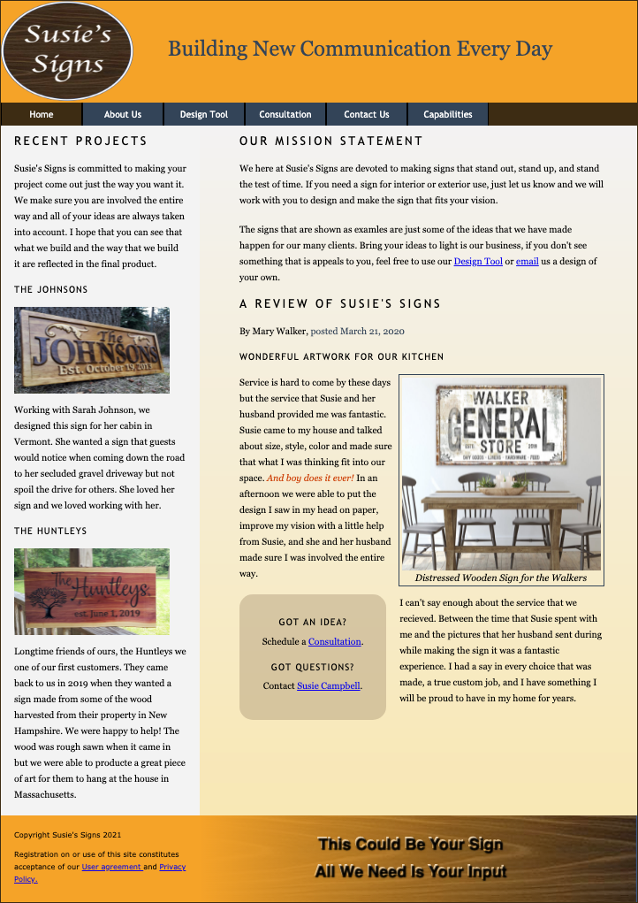
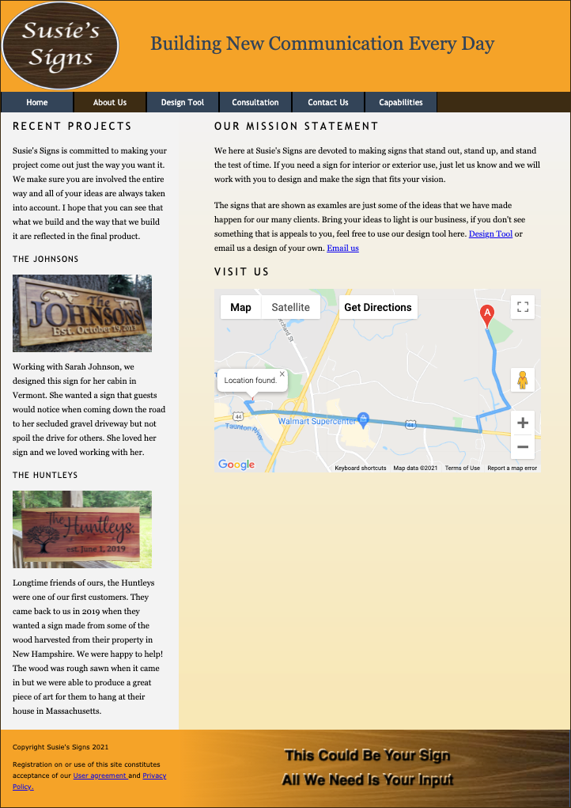
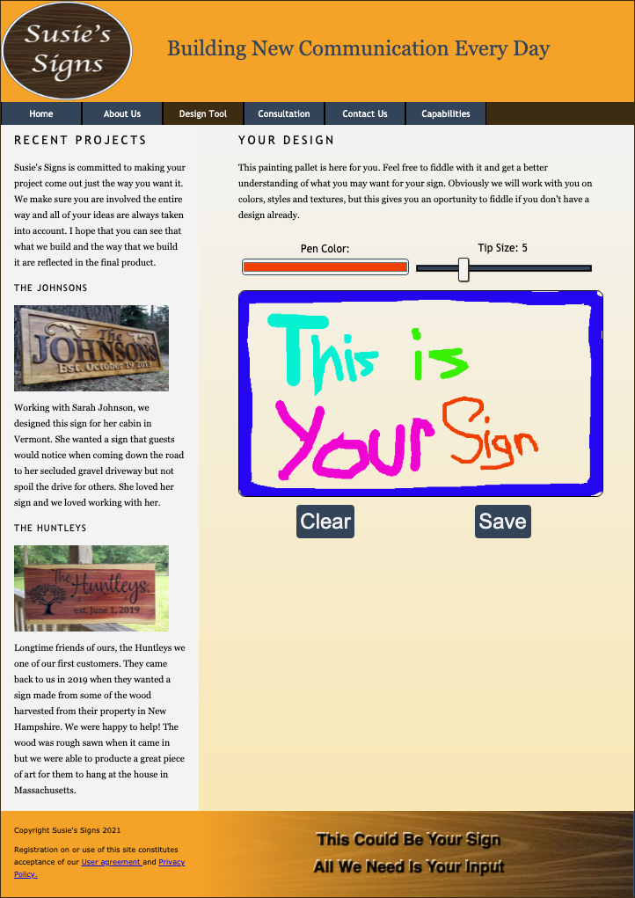
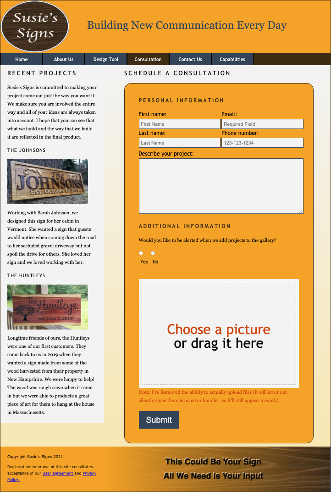
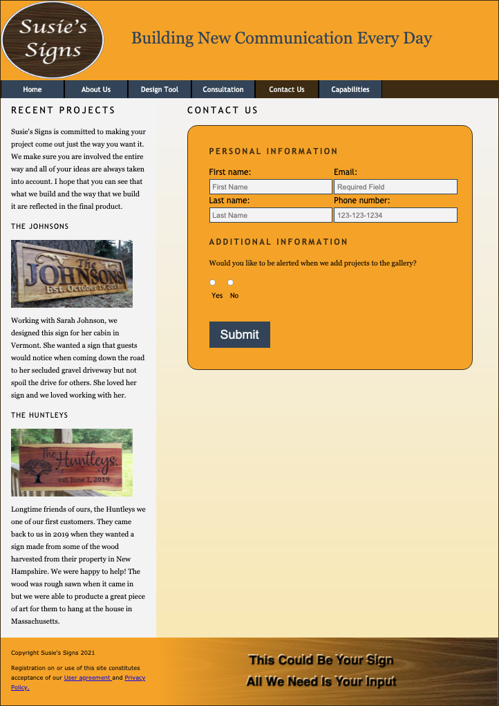
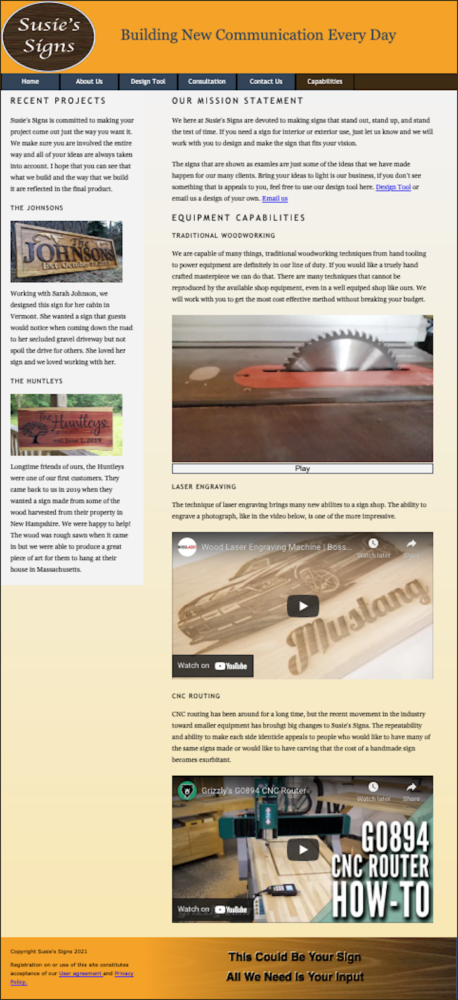

# DESCRIPTION

This site was developed to complete an HTML5 course that I took as part of the second bachelors degree program UMASS Lowell. The requirements set forth for the assignment are detailed below.  My wife has talked endlessly about starting a business like this, making signs using the technologies on the Capabilities page. All of the signs were made by others and the pictures were borrowed from Etsy.  The descriptions are completely fabricated to make the site look and feel like a real business.  So much so that my professor asked us to make signs for him, I had to let that oportunity go since we are definitely not up and running yet.  

#
# FINAL PROJECT DESCRIPTION

Your Final Project, which accounts for 25% of your Total Grade, will be a fully functioning Website!

Based on the Lessons that you will complete in the text book, you will supply the HTML code for a functioning website of at least six pages. The subject can be of anything you choose; sports team, restaurant, photography, small business, hobby, school, personal life ... anything!
Don't spend too much time with design work, color themes, etc.; this is an HTML class, not a web design class; all six pages need not be related, as long as all the functions work.

As I previously mentioned, the first several Lessons will give you a working 6-page website ... you don’t need to re-invent the wheel ... most code used today is recycled ... so use that as your base/template, and then make the pages your own with different subject matter, colors, , etc.
One final request: keep the audio/video files short ... I don’t need to watch a three-hour adaptation of War & Peace; I just need to see that you know how to insert it. I don’t want to wait five to ten minutes for you project to download; try to keep it under 50MB!

## Required Components

| Requirement | Points |
|---|---|
|6 pages | 3 |
|Use of CSS | 2 |
|Functional Navigation Bar | 3 | 
|Links to Internal and External Pages  | 3 | 
|Footer with Background Image | 2 |
|A working Form| 2 | 
|JavaScript and jQuery | 2 | 
|Audio/Video File *(embedded, not external link)* | 2 | 
|A Canvas Drawing | 2 | 
|A Geolocation Instance | 2 | 
|An Instance of Drag and Drop | 2 | 

#
# FINAL SITE PAGES
##
## Home Page

Trying to stay true to a color scheme that I selected to make a calm and appealing site.  I tried to use earth tones and some but not too many pictures to create a site that looked professional and was easy to read.

##
## About Page

The about page was my first foray into the google maps API with location and directions integration.  A visitor to the site can click a button and using their current location get directions to the “location” where signs could be purchased.  I used the location of the Raynham Flee Market, a logical first choice for a business to get its name out there.

##
## Design Page

The design tool was a very cool project in itself.  I learned a ton designing and developing a drawing pallet for people to use to make a rough draft of their sign.  This uses the canvas element to create a pallet and the user is able to select color and pen tip size and draw anything they want with their mouse.  A user can also save their creation as a PNG file to send it to us later.

##
## Consultation Page

The consultation page is used to get in touch with the “team” at Susie’s Signs concerning a specific project and a user can upload a file either created on the design tool page or created in any other format.  For my project I left the error handling out and allowed the form to submit since the site has no backend.  

##
## Contact Us Page

Contact us is a simpler form that would be to be notified of changes and to sign up for a newsletter or similar.  More of a way for people to stay in touch rather than request information on a particular project.

##
## Capabilities Page

The capabilities page contains a video player for a video that I made of the existing table saw in my woodshop and embedded links to two amazing pieces of equipment that would be fantastic additions to my shop, and would make starting a real business pretty easy, although extraordinarily expensive.  

#
# PHOTOGRAPHS AND VIDEOS

Photographs were borrowed from Etsy since I don’t have the ability to make signs – yet.  There are many talented artists creating beautiful wooden signs that can be found for sale on Etsy https://www.etsy.com/

Manufacturer videos were used from youtube the links to the actual equipment is below:
* Grizzley CNC Router https://www.grizzly.com/products/grizzly-24-x-36-cnc-router/g0894
* BossLaser Engraver https://www.bosslaser.com/full-laser-line-up/boss-hp-2436.html

#
# PLANS FOR THE FUTURE

My wife is facinated by these "toys" and would love to start a business. When we get around to starting this I will need to make some sample signs and take some pictures to replace those from Etsy.  Then toss a back end on it and find an available URL.  
